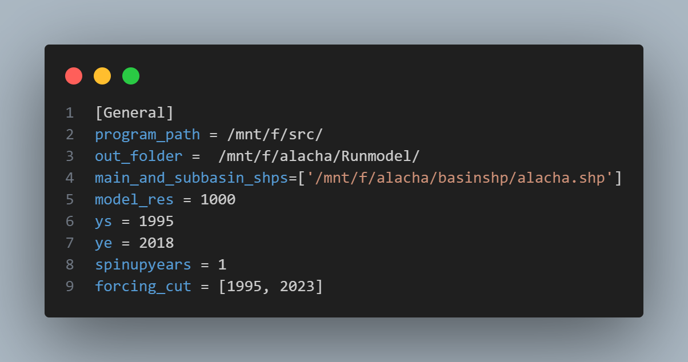
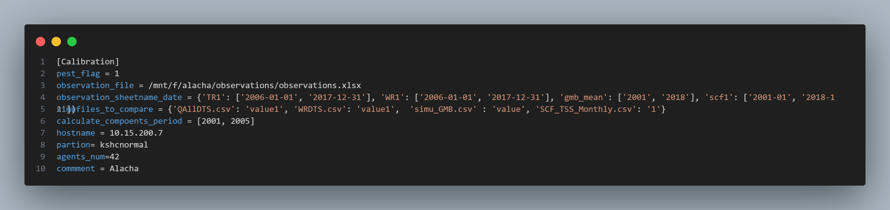

# Introduction to the Pre-Processing Tool

The main purpose of this tool is to simplify the preparation required to run the SPHY model. Preparing input files is often time-consuming, especially when hydrological simulations need to be performed for multiple basins at the same time. With this tool, users only need to provide the basin shapefile, specify the model resolution, and define the simulation start year. The tool will then automatically generate all essential input files required to run the model.

If auto-calibration is desired, a few additional files are needed; however, the tool still greatly streamlines the workflow by requiring only a small amount of basic information. The overall process is illustrated in the diagram below:


## Overview of the Structure

````{admonition} Files


📁 Tools  
Scripts that assist with data preparation or post‑processing of model outputs.

📁 global_database  
Global datasets required for running the model. Can be downloaded from https://www.dropbox.com/scl/fo/xwegzjtjsuu4khnzut948/APClH3tg_iQVSXqD2SqnFBc?rlkey=4zpzgke2a1wg2pckdkus4llko&st=myfz42qo&dl=0

📁 src  
Source code.

📄 environment.yml  
YAML file for creating the conda environment with all required dependencies.

📄 preprocess_Alahca.cfg  
Example configuration file defining the model resolution and all required input paths/settings.

````

👉 Run the program using: `./run_preprocess.sh XX.cfg`  
`XX.cfg` is the global configuration file. A detailed description of all settings is provided in the next section.

---

(preprocessing_tool_config_section)=
## Introduction to the Configuration File

`preprocess_Alahca.cfg` is an example configuration file. All parameters required to run this tool are specified here. 
There are **six sections** in total (General, Forcing, Glacier, Statistic, Calibration, Database). See below for the description of the parameters in each section.

---

(General settings)=
### General Settings


* **program_path**: Folder where the `src` directory (main script) is located.  
* **out_folder**: Directory where the outputs will be saved. <span style="color:red"> Note this is not the folder where model results will be saved; this is the folder where you will run the model </span>. This will be explained later in {doc}`3.Run_the_preprocessing_Tool`.

* **main_and_subbasin_shps**: Path to the basin and sub‑basin (if available) shapefiles. The biggest main basin must be the first one.
* **model_res**: Spatial resolution of the model grid (unit: meters).  
* **ys and ye**: Start and end year of the simulation.  
* **spinupyears**: Number of spin‑up years.
* **forcing_cut**: Trim the forcing data in the database to the specified time range. At least need to cover the modeling period.

---

### Forcing Settings


* **prcp_bands_num**: Number of elevation bands used for precipitation correction. The elevation will be evenly divided based on quantiles. Set this to 1 if elevation bands are not required. In other words, the basin is treated as a single unit.
* **pcrp_correction_factors**: Multiplicative precipitation correction factors for each elevation band (values >1 increase precipitation, values <1 decrease i).  
* **tem_bands_num**: Number of elevation bands for  temperature correction. 
* **t_deltas**: Temperature correction factor offsets for each band (°C). Positive values increase temperature, and negative values decrease temperature. 
* **tem_lapserate**: Temperature lapse rate used for downscaling the forcing dataset to the fine‑resolution grid (unit: °C/m).  Typical value is **0.0065 °C/m**.  The model computes the elevation difference between the forcing DEM and the basin DEM, and then applies the lapse rate to downscale temperature. <span style="color:blue">You may leave `tem_lapserate` empty. The program will automatically compute a lapse rate based on the elevation–temperature relationship in the forcing dataset.</span>

* **gradient_downscale_flag**: Enable precipitation gradient downscaling (1 = on, 0 = off).  
* **p_gradients**: Precipitation gradient for downscaling (**unit: %/m**).

---

(glacier setting)=
### Glacier Settings


* **choose_rgi_id_zone_file**: A CSV file where the first row contains the region codes ([RGI V7](https://www.glims.org/RGI/)) and the second row contains the glacier IDs. You can choose any glaciers you want. The program will then use the selected IDs to calculate and output the regional mean mass-balance time series. Using [RGI V6](https://www.glims.org/RGI/) is also allowed, but the {ref}`source of glacier data <database_par>` need to be changed to RGI V6.  
<span style="color:blue"> You may leave this option empty; in that case, the program will automatically generate it and include all glaciers within the basin. </span>

**Example:**  
  


* **glacier_resolution**: Resolution for glacier modeling, depending on the input DEM for glaciers (specified in the Database section).  
* **glacier_tem_lapse**: Temperature lapse rate for downscaling the coarse forcing dataset to the fine glacier grid (typical: −0.0065 °C/m).

---
(snow_ele_bands)=
### Statistics Settings


* **scf_statistic_flag**: Enable snow‑cover statistics (1 = on, 0 = off).  
* **snow_threshold_min**: Minimum snow depth threshold (e.g., mm) to classify a pixel as snow‑covered. 
* **statistic_bands_number**: Number of elevation bands used for snow statistics. The elevation will be evenly divided based on quantiles. <span style="color:blue"> If set to 1, then the output is the average of the whole basin.</span>
* **wintermonth**: Months considered as winter for winter‑discharge outputs.

---
(Calibration config)=
### Calibration Settings
This section can be ignored if the auto-calibration is not needed.


* **pest_flag**: Enable automatic model calibration using PEST (1 = on, 0 = off).  <span style="color:blue"> If set to 1, all parameters in this section must be provided.  </span>

* **observation_file**: Excel `.xlsx` file containing all observation data used for calibration. Example structure:  
     
   - `TR` = total runoff, `WR` = winter runoff.  Values 1 to N correspond to basins/sub‑basins in the same order as specified in `main_and_subbasin_shps` of {ref}`General settings <General settings>`.  
   - `scf` = snow‑cover fraction.  <span style="color:red;"> 1 to N refer to elevation bands (low → high), **not** sub‑basins</span>. In other words, the program does not support SCF calibration at sub-basin scale.
   - `gmb_mean` = Annual glacier mass balance observations for the entire basin. Will be compared with the model outputs, determined by `choose_rgi_id_zone_file` in the {ref}`glacier setting <glacier setting>`.

* **observation_sheetname_date**: Sheet name and time range (YYYY‑MM‑DD) used for each dataset.  
* **simufiles_to_compare**: Simulation output files to compare with observations. <span style="color:blue;"> Note that the output filenames are fixed — do **not** change the name here. </span> At the moment, only the following variables are supported for calibration:

   - **Total runoff** — `'QAllDTS.csv': 'value1'` . Values 1 to N correspond to basins/sub‑basins. If you have sub-basins, you can add more, e.g., `'QAllDTS.csv': 'value2'`. 

   - **Winter discharge** — `'WRDTS.csv': 'value1'`. Used to give extra weight to winter low‑flow.  You may also use `'WBDTS.csv'` when winter discharge represents most baseflow. Same as the total runoff, Values 1 to N correspond to basins/sub‑basins. 

   - **Glacier mass balance** — `'simu_GMB.csv': 'value'`. Only a single time series will be generated, which determined by `choose_rgi_id_zone_file` in the {ref}`glacier setting <glacier setting>`. No elevation bands, no sub-basins.

   - **Snow‑cover fraction** — `'SCF_TSS_Monthly.csv': '1'`  <span style="color:red;"> 1 to N correspond to elevation bands (low → high), not basins.</span> The number of bands are defined in {ref}`statistic_bands_number <snow_ele_bands>`

* **calculate_components_period**: Start and end year for calculating runoff components. 
* **hostname**: Hostname or IPv4 of the compute node (`hostname` or `hostname -I`).  
* **partion**: Partion name (e.g., using `sinfo` to check on Slurm system).  
* **agents_num**: Number of agents/simultaneous jobs (suggested: 2 × number of parameters + 1).  
* **comment**: Comment this auto-calibration run; will be saved in `pest_run_report.csv`. For example: 'decrease free parameters', 'using modified glacier modules', 'test run', etc.

````{hint}
If you run the auto-calibration, `pest_run_report.csv` stores all parameter combinations tested by PEST, plus basic statistics (e.g., NSE and component contributions). This file is saved automatically.

````
---

(database_par)=
### Database Settings


This section defines the sources of all datasets.  
You may use your own datasets as long as the data formats are consistent.

````{Note}
* It is recommended to provide **absolute paths** rather than relative paths.  
* For different model resolutions, use HydroDEM files with similar resolutions. [HydroDEM](https://www.hydrosheds.org/) is a hydrologically conditioned DEM (pit‑filled, corrected), suitable for watershed boundary extraction.  
````
