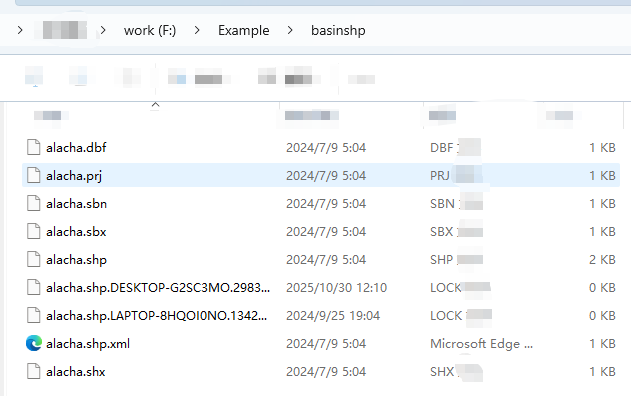
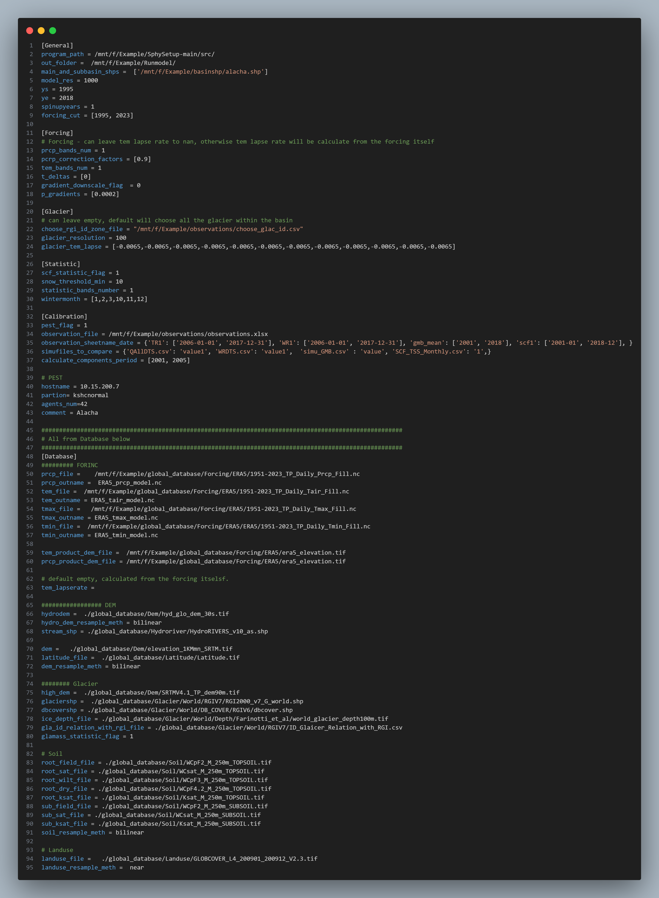
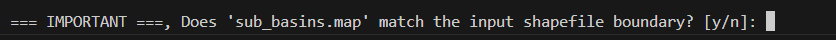
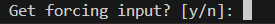

# Run the Pre-Processing Tool

In this section, an example is provided to show how to use the pre-processing tool to set up the model,
and how to run the model with and without auto-calibration.

The case basin is **Ala-Archa**, which is located in the Tien shan.  

(He et al.,2020)

Located in Kyrgyzstan, Central Asia, the Ala-Archa basin drains an area of 233 km^2 (Fig. 1), and glaciers cover around 17% of the basin area. The elevation of the study basin extends from 1560 to 4864 m a.s.l., and the elevation range of the glacierized area extends from 3218 to 4857 m a.s.l., with about 76% located between 3700 and 4100 m a.s.l. Detailed basin information can be found at He et al. (2020)

````{warning}
This catchment is chosen because it is relatively small, which helps speed up the demonstration. However, in general, <span style="color:red"> using this tool on catchments of this size is not recommended </span>. Small catchments require a much finer-resolution DEM to correctly delineate watershed boundaries, which increases the likelihood of errors. Recommended size: > 10,000 km^2.
````

## Download the Scripts and Database
* Create a folder on your local PC. Here, I create a folder called **example** on the F drive. More practical: name it "Ala-Archa," which is the basin name.
* Download the scripts from [GitHub](https://github.com/jingheng-huang/SphySetup). 
* Global datasets required for running the tool can be downloaded from Dropbox: `https://www.dropbox.com/scl/fo/xwegzjtjsuu4khnzut948/APClH3tg_iQVSXqD2SqnFBc?rlkey=4zpzgke2a1wg2pckdkus4llko&st=hrntq8kg&dl=0.`  
Note the database is big (~200GB); you can also save it to your hard drive.


The description of the structure has been provided in {doc}`2.Introduce_the_preprocessing_tool`.

## Prepare the Basic Inputs

<span style="color:blue"> The key point is to prepare a basin-boundary shapefile, which will be used to clip the database to the study watershed. </span> If you plan to use the auto-calibration module,  an `observations.xlsx` file that contains some observation datasets is also needed. The following preparation steps and folder-naming conventions are simply personal preference, you may freely adjust them according to your own workflow.


* Create two folders called **basinshp** and **observations**. You may place them anywhere; here, I put them under **'Example'**. 
 
---
* In the **basinshp** folder, place the basin shapefile (**projection: WGS84**). This shapefile will be used as the standard basin boundary for clipping the DEM and other datasets. <span style="color:red"> **Make sure the boundary is correct**.</span> You can verify it using [this website](https://mghydro.com/watersheds/)



---

* **If  auto-calibration will be used**. In the `observations` folder, include a single Excel file (`observations.xlsx`, or any name you prefer) that contains all observation time series used for comparison with the model outputs. The required format is described in {ref}`Calibration settings <Calibration config>`.
I usually place all raw observation files inside the observations folder and then merge them into a single `observations.xlsx`.
<span style="color:blue">If you do not need auto-calibration, this file is not required.</span>

````{note}
**Optional**:  
If you want to calculate the glacier mass balance from specific glaciers, prepare a CSV file containing the glacier IDs from RGI V7 or V6. The required format is described in {ref}` glacier setting <glacier setting>`. <span style="color:blue"> If you skip this file, the program will automatically generate this file which contains all the glacier ids in the basin.</span>
````


## Set Up the Configuration File
Prepare the configuration file following the instructions in  
{ref}`Introduction to the Configuration <preprocessing_tool_config_section>`. Here I set the out folder to `Example/Runmodel` in the Configuration file. The Runmodel folder will be created automatically and everything will be saved to this folder.

````{warning}
In the configuration file, each parameter must be written on a single line. **Do not** split a parameter setting across multiple lines.
````




## Run the Tool
Once the configuration file is ready, go to the **SphySetup-main** directory (downloaded from Github), activate the conda environment with `conda activate pcraster ` and run:

`
./run_preprocess.sh preprocess_Alahca.cfg
`

````{note}
Make sure that `run_preprocess.sh` is located in the same directory as `src`. Because the script looks for the source code (src) relative to the current working directory.

The configuration file (`preprocess_Alahca.cfg`) can be saved anywhere.


````

During the first run, the script will take some time to clip the river shapefiles, which speeds up subsequent processing. 
After this step, a folder named **input** will be created inside the **output** directory specified in the configuration file.  
<span style="color:blue">  Open this folder and open `sub_basins.map` in QGIS (or any GIS software) to check whether the generated watershed boundaries match the actual ones. <span>


````{important}
<span style="color:blue"> This step is very important. If the generated boundaries differ noticeably from the actual watershed boundaries, consider the following:</span>

* **Check whether the DEM resolution matches the model resolution.**  
  For example, if the model resolution is set to 1000 m, the HydroDEM resolution should also be around 1000 m.

* **Check whether the river network is correct.**  
  The river network shapefile is located in the cache folder inside the `SphySetup-main/src/` directory.  
  If the network extends outside the watershed boundary or connects incorrectly with rivers from another basin, consider manually fixing it or using a different data source.

* **Consider using a different HydroDEM or manually editing the DEM.**  
  QGIS provides plugins that allow raster value modification.  
  **Note:** Only modify the HydroDEM used for watershed extraction — *not* the actual DEM file.
````

If the watershed boundary is correct, press **y** (yes) to proceed.  
  
  
  
   

---
Once the run finishes, a complete package of files and scripts required to run the model will be created in the output directory specified in the configuration file. Under this output directory, you can run the model with and without auto-calibration with simple command. Instructions for running the model are provided in the {doc}`4.Run_model` chapter.

   


