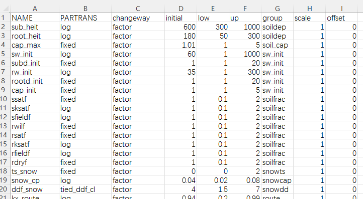

# Run Model

## Run the model without Auto_Calibration  

 

---
Enter the Runmodel folder, which is the output folder you specified in the configuration file in the previous step. Then run:  
`./run_model.sh`  

The model parameters are stored in the file `standard_global.cfg` located in the same folder. You may modify the parameters, output paths, and other settings as needed.


## Run the model with Auto_Calibration

Upload all files under the Runmodel folder to the cluster.

After entering the `Run_pest folder`:

Open run_autocali.sh and update the paths to the cluster paths.
For example, /mnt/f is the path used in the Windows WSL environment; replace it with the path on the cluster.
Also check whether the hostname, partition, and other settings are correct. How to set hostname and partition and agents_num, check {ref}`here <hostinfo>`.


````{note}
**Optional**: If you need to modify the initial parameter values or choose which parameters to include in the calibration, open parameter.csv in the `Run_pest folder`.
For example, fixed means the parameter will not be calibrated, while initial, low, and up correspond to the initial value and the allowed minimum and maximum ranges.
Other fields can remain as default. For more details, refer to the PEST documentation (https://pesthomepage.org/).


````

